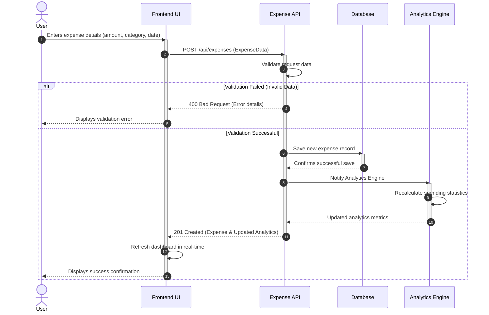
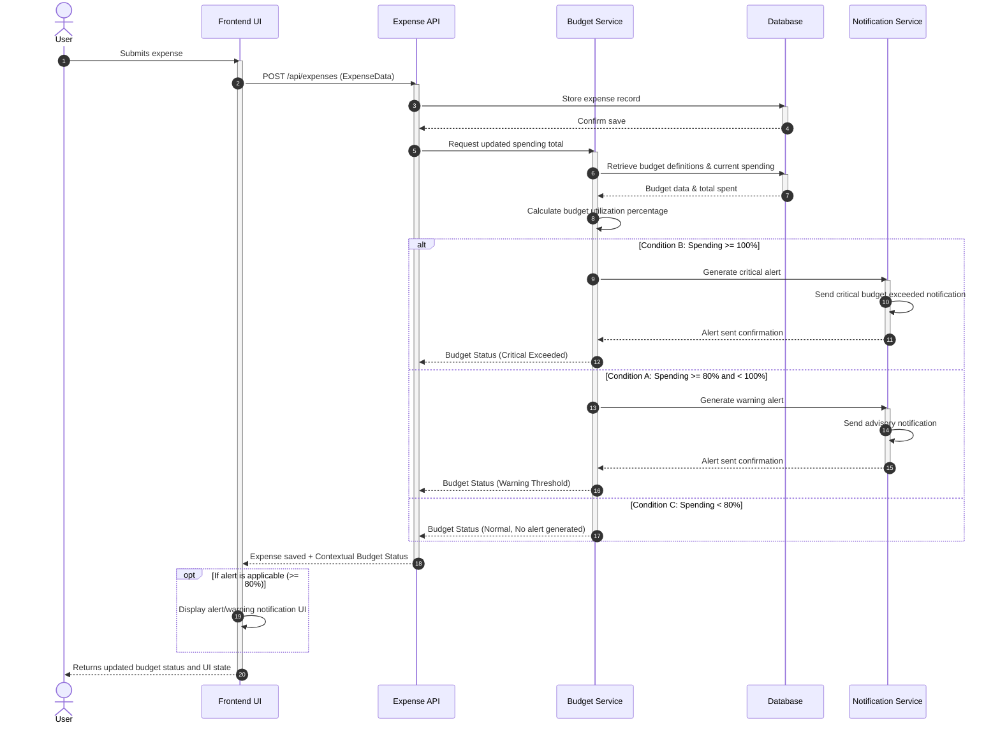
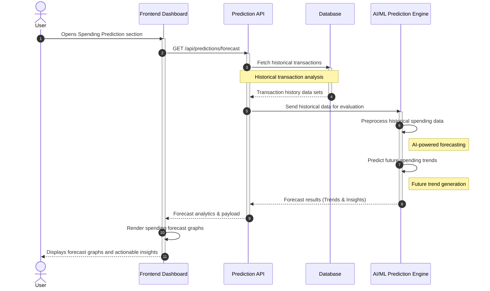

# AI-Powered Expense Analyzer & Budget Assistant
## UML Sequence Diagrams

This document contains professional enterprise-level UML sequence diagrams representing the core flows of the system.

### Diagram 1: Add Expense Flow

**Scenario:** The user has valid expense details (amount, category, date) and submits a new expense. The system stores the record, updates analytics, and refreshes the UI.

---

### Diagram 2: Budget Warning (80% / 100% Threshold)

**Scenario:** Predefined budget limits exist, and a new expense is added. The system calculates the budget utilization percentage and conditionally triggers advisory or critical alerts via the Notification Service.

---

### Diagram 3: Spending Prediction Flow

**Scenario:** The user wants future spending forecasts. The system pulls historical transaction data and delegates trend generation to the AI/ML Prediction Engine.

