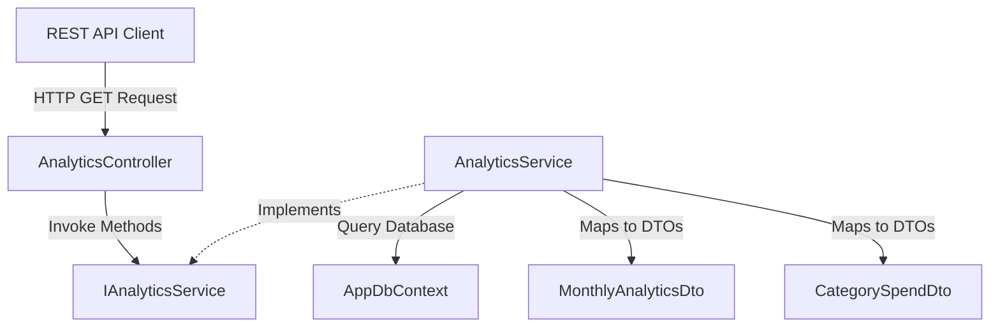

# Analytics & Testing Module Documentation

This document describes the design, implementation, REST endpoints, and testing infrastructure of the **Analytics Module** of the AI-Powered Expense Analyzer & Budget Assistant.

---

## 1. Directory Structure

All analytics and testing code is located in the following folders:
- **DTOs:** `src/ExpenseAnalyzer.Core/DTOs/Analytics/`
- **Interfaces:** `src/ExpenseAnalyzer.Core/Interfaces/IAnalyticsService.cs`
- **Services:** `src/ExpenseAnalyzer.API/Services/AnalyticsService.cs`
- **Controllers:** `src/ExpenseAnalyzer.API/Controllers/AnalyticsController.cs`
- **Unit Tests:** `tests/ExpenseAnalyzer.UnitTests/`
- **Integration Tests:** `tests/ExpenseAnalyzer.IntegrationTests/`

---

## 2. Architecture & Components

The architecture follows standard MVC/Clean architecture, separating domain contracts, business services, mapping DTOs, and REST API controller layers.



### A. Core DTOs
1. **`MonthlyAnalyticsDto`**: Holds `Month` (string), `TotalExpenses` (decimal), `TotalTransactions` (int), and `AverageExpense` (decimal).
2. **`CategorySpendDto`**: Holds `CategoryName` (string), `TotalAmount` (decimal), and `Percentage` (decimal).

### B. Business Logic Scopes (`AnalyticsService`)
All calculations are encapsulated in the service layer using LINQ to DB projections:
* **Monthly summary**: Dynamically aggregates user transaction entries matching target month and year, computing sum totals and counts. Generates the average dynamically; handles empty data sets safely by returning 0 values without causing runtime divide-by-zero errors.
* **Category spending**: Maps and groups user categories. Calculates percentage distributions based on total monthly costs. Results are sorted by spend volume descending.

---

## 3. REST API Specification

### A. Get Monthly Spending Summary
- **Endpoint**: `GET /api/analytics/monthly`
- **Query Parameters**:
  - `userId` (int, required): ID of the target user.
  - `month` (string, optional): Target month formatted as `YYYY-MM` (e.g. `2026-08`). Defaults to current month if null.
- **Example Response (200 OK)**:
  ```json
  {
    "month": "2026-08",
    "totalExpenses": 8700.00,
    "totalTransactions": 3,
    "averageExpense": 2900.00
  }
  ```

### B. Get Category Spending Breakdown
- **Endpoint**: `GET /api/analytics/category`
- **Query Parameters**:
  - `userId` (int, required): ID of the target user.
  - `month` (string, optional): Target month formatted as `YYYY-MM` (e.g. `2026-08`).
- **Example Response (200 OK)**:
  ```json
  [
    {
      "categoryName": "Rent",
      "totalAmount": 5000.00,
      "percentage": 57.47
    },
    {
      "categoryName": "Groceries",
      "totalAmount": 2500.00,
      "percentage": 28.74
    }
  ]
  ```

---

## 4. Testing Infrastructure

Both unit and integration tests are isolated in their respective projects, keeping teammate codebases completely pristine.

### A. Unit Tests (`ExpenseAnalyzer.UnitTests`)
Uses **xUnit** and **Moq** to validate:
* Empty data scenarios (returning zero values gracefully).
* Multi-transaction calculations.
* Complex category splits and percentages.
* Date fallback mechanisms.
* Model validation filters inside `AnalyticsController`.

### B. Integration Tests (`ExpenseAnalyzer.IntegrationTests`)
Uses `Microsoft.AspNetCore.Mvc.Testing` to spin up a mock test server overlaying custom in-memory databases with unique identifiers per test execution. Validates:
* Response HTTP status codes (`200 OK`, `400 BadRequest`).
* Response structure mappings to DTO definitions.
* End-to-end calculations.
